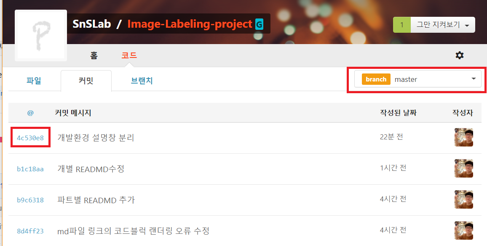
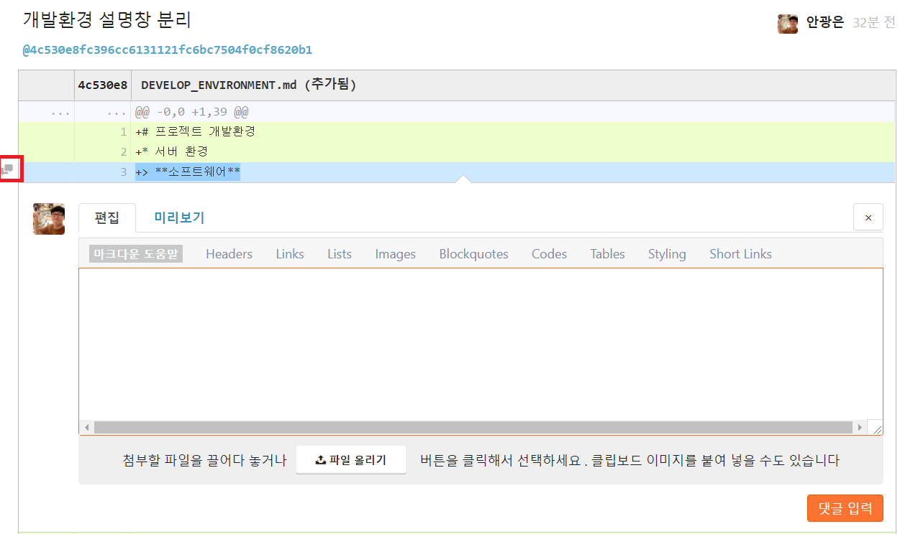

# 개발자 README

## FAQ 및 개발 가이드 라인

* **프로그램 및 소스코드의 한국어 깨짐 현상**
 한국어 기반의 개발인 관계로 개발 환경에 따라 소스코드 저장 방식이 한국어 저장 포맷인 CP1252, EUC-KR, ISO-KR, MS949인 경우가 있습니다. 이 때 현재 사용 중인 Git 서버의 언어 환경이 UTF-8 포맷만 인식할 수 있어 상위 포맷들을 정확하게 읽지 못해 깨진 한국어를 UTF-8포맷으로 변환하여 저장합니다. 이 때 소스코드를 다시 서버로부터 불러오는 경우 **한국어 포맷** --> **UTF-8 변환 저장** --> **한국어 포맷** 으로 변형되어 복구될 수 없는 한국어 손실을 일으킵니다.
 서버의 언어 지원을 늘리는 것은 현재 고려하고 있지 않습니다. 그 이유는 향후 이 프로그램이 재사용 되는 경우 시스템에 따라 폰트가 깨져 **한국어가 소실되는 것을 방지하기 위해 정책적으로 UTF-8로 저장 방식을 권고**하고 있습니다. 버전관리 프로그램을 사용한 프로그램 업로드 시 주의를 요망합니다.
 대부분의 개발 IDE나 텍스트 에디터는 저장 전에 파일 인코딩을 지정할 수 있습니다. 이 중 중요한 설정으로는 파일 포맷을 **한국어 포멧 --> UTF-8**로, 개행을 **Carriage Return(CF) --> Line Feed(LF)** 으로 사용할 것을 권장합니다. 사용하는 에디터에 따라 개행에 대한 설정 정보가 없을 수 있습니다. 이 개행은 무시하고 인코딩만 설정합니다.

* **프로그램이나 소스코드의 버그 발견 후 제안 권고 방법**
 타 파트의 버그 발견 시 해당 내용은 직접 전달해주시면 됩니다. Git 서버를 사용하여 공유하려 하였으나 서버가 업데이트시 불안정한 경우로 인해 이슈 관리가 제대로 기록에 남지 않는 문제가 있어 해결 방안을 모색하고 있습니다. GitHub 사용은 현재 고려중에 있지 않습니다. 공개 개발 프로젝트로 전환 가능하다면 GitHub 서버로 변경할 예정입니다.

* **개발 관련 문서 생성**
 개발 관련 문서는 간단한 설명을 하는 텍스트 파일과 마크다운(Markdown)언어를 사용하는 md로 구성되어 있습니다. 최근 md는 설명을 기술하는데 있어 단순 텍스트 파일보다 의미를 효과적으로 전달하면서 낮은 복잡성을 유지하는 언어로서 사용되고 있습니다. 마크다운은 언어에 대한 공부가 필요하지만 시각적 전달에 있어 대부분의 환경에 공유 가능하면서 동시에 상대적으로 적은 시간을 들일 수 있어 **설명관련 문서 작성 시 md로 작성하는 것을 권장합니다.**

* **추가 질의 문의**
 회의시간 어느 때나 질의해주면 정리하여 게시하도록 하겠습니다. :) ~

----

## 코딩 스타일 가이드라인

### Php 코딩 

### Python 코딩

 Python은 이미지 크롤링, 딥러닝에 사용되는 언어입니다. Python은 인터프리터 언어 특징상 개발하는 환경에 따라 들여쓰기(indent)등이 프로그램 수정 및 실행에 매우 많은 영향을 받습니다. 이는 개발 도구에 따라 많은 형태의 파일 깨짐 현상 및 표기 현상이 발생할 수 있습니다. 방법을 통일시키기 위한 가이드라인입니다.

#### 파이선 작성 규칙

* **디버깅 및 문서 규칙**
 Python언어는 실행 단계에서 프로그램의 실행 문제를 보여줍니다. 또한 다양한 표현이 가능한 Python언어의 특징상 문서화에 있어서 다양한 표현이 사용됩니다. **일관성 있는 코딩과 문서 규칙을 위해서 pylint를 사용하여 코드 검사를 권장합니다.**

* **예외처리(Exception)**
 예외처리는 프로그램의 오류에 대한 메세지를 개발자나 사용자에게 쉽게 전달 할 수 있는 도구입니다. 그러나 이러한 예외처리는 개발시 처리되는 정보의 중요도에 따라 필요한 정보를 노출하지 못할 수 있습니다.

* **람다 함수(Lamda Functions)**
 람다 함수의 장점은 익명 클래스와 같이 익명 함수를 만들 수 있다는 점입니다. 일반적으로 콜백(Callback)이나 수식 위주의 함수를 간편화하는데 쓰입니다. 그러나 잦은 사용은 가독성을 떨어뜨리며 디버깅시 에러의 단계가 증가시켜 버그 검출에 어려움을 줄 수 있습니다.

* **중지 예정 함수 사용(Deprecated Function)**
 함수 사용중에 버전차이로 인한 사용 중지된 함수가 있습니다. 버전 업그레이드에 따라 많은 영향을 받을 수 있으므로 사용을 최소화 하는 것을 권장합니다.

* **세미 콜론(Semicolon)**
 Python은 프로그램 끝에 세미 콜론 사용을 허용합니다. 그러나 프로그램에 있어 한 행에 두 기능을 허용할 수 있게 하므로 코드의 가독성을 낮추기에 **사용을 금지 합니다.**

* **소괄호(Parenthese)**
 소괄호의 크기는 최소한으로 합니다. 단, 변수를 여러개 받는 경우 개행으로 처리하거나 변수간의 구분을 위헤 스페이스를 추가하여 작성하는 것을 권장합니다.
 ```python
 def example(arg_1, arg_2, arg_3
                arg_4, arg_5)
 ```

* **들여쓰기(Indent)**
 Python에서 들여쓰기는 기타 다른 언어의 중괄호와 같은 코드의 영역을 지정하는 방법중 하나입니다. 개발하는 도구에 따라 들여쓰기는 띄어쓰기(Space)나 탭문자(tab-character;\t)를 사용하게 되며 띄어쓰기 경우 코드에서 최초 등장한 간격을 기준으로 하위 코드의 영역을 구분합니다. 이 들여쓰기가 혼용된 코드의 경우 프로그램이 정상적으로 동작하지 않습니다.

* **이름 짓기**
 프로그램의 가독성을 위해 이름 짓기 규칙성은 필수입니다. 파이선 개발자인 Guido의 가이드라인에 따라 작성하는 것을 권장합니다.


* **복합, 지역, 내부 클래스**
 클래스를 작성시 복합, 지역, 내부 클래스가 필요합니다. 그러나 객체가 다른 타 클래스와 상호작용이 일어나는 경우 스파게티 코드가 될 가능성이 높습니다. 이를 방지하기 위해 **읽기만 가능한 함수들로 구성하는 것을 권장합니다.**

* **배열 이해(List Comprehensions)**
 배열은 같은 타입의 데이터를 다루는데 매우 효율적인 자료구조입니다. map(), filter(), xrange(), 람다 표현식(Lamda expression) 을 사용한 방법은 코드를 매우 간결하게 작성할 수 있으나 프로그램의 의도를 파악하기 어려워질 수 있습니다. **프로그램의 가독성을 위해 배열 데이터를 직접 조작하는 것을 권장합니다.**

* **참(True)/거짓(False)의 Boolean 작업**
 현재의 상태를 나타내는 방법으로서 참/거짓 변수를 사용합니다. 그러나 만드는 변수의 목적에 따라 참 혹은 거짓으로 변수값 중 하나를 저장하여 사용하게 됩니다. 이러한 상태값 저장에 있어서 **코드의 가독성을 위해 보통 거짓 상태를 기본으로 사용합니다.**

* **매개변수(Argument)의 초기화**
 코딩 기법이 발전함에 따라 변수의 복잡성을 줄이기 위해 매개변수에 기본값을 지정할 수 있습니다.
 ```python
def foo(a, b = time.time())
 ```
 그러나 이러한 방식의 사용법은 코드가 미처 읽혀지지 않는 함수나 변수를 사용하게 된다면 복잡한 에러코드를 받을 가능성이 높고 디버깅 속도를 줄이는 원인이 되기도 합니다. 또한 각 매개변수별로 예외처리 코드가 작성되어 가독성을 감소시키는 원인이 됩니다. 이를 위해 매개변수 초기화시 **None을 사용하여 초기화하고 함수 내부에서 매개변수를 재정의 하는 것을 권장합니다.**
 ```python
 def foo(a, b=None)
    if b is None:
        b = time.time()
 ```

## 코드 협업 도구 가이드라인

 현재 사용하고 있는 Git 서버 특성상 병합(Merge)요청에 대해 제한이 없어 자신의 파트에 타 인원이 코드 수정을 가하는 경우 Commit 기록(History)를 자세히 관찰하지 않는 이상 코드의 변화를 놓치기 쉽습니다. 이는 파트 담당자가 원하지 않은 코드 변경이 발생할 여지가 있고 이로인한 기대하지 않은 코드 동작으로 프로그램 작성에 혼란이 발생할 우려가 있습니다. 이를 방지하기 위해 **자신의 파트가 아닌 부분에 대해 코드 수정은 직접적으로 하지 않도록 합니다.** 그러나 코드 리뷰 시 작성에 관한 에러나 문제점을 찾는 경우 이를 보완할수 있도록 하기 위한 여지는 필요하다고 생각됩니다. 이를 위해서 현재 운용하고 있는 Git 서버의 Commit 히스토리 기능을 이용하여 설명할 내용에 관하여 작성합니다. 단, 브렌치 중 **"-develop"**가 끝에 붙어 있는 브렌치에 대해서는 의견 작성을 하지 않습니다.

 * **Commit 의견 첨삭 기능 사용방법입니다.**
 코드의 커밋(Commit)으로 이동하여 수정할 브렌치 선택 후 수정할 커밋을 선택합니다.
 
 첨삭을 할 라인의 좌측 메세지 박스를 선택 후 의견을 작성 후 저장합니다.
 

* **깃(Git) 사용시 주의사항**
 깃 명령어는 제한없이 사용이 가능하지만 일부 기능은 신중하게 사용되어야 되는 기능이 있습니다. 대표적으로 master 브랜치(branch)에 대한 직접적인 merge 작업과 tag 명령어는 브랜치 관리의 일관성을 떨어뜨릴 수 있기에 신중하게 사용되어야 합니다.

* **Git의 브랜치(가지) 사용 및 명명 방법**
 프로젝트의 버전 관리 도구로서 Git를 사용하고 있습니다. Git의 특징은 개발하는 특성에 따라 다양한 브랜치를 구성하여 사용하더라도 다른 브랜치와 충돌을 일으키지 않는 것이 그 장점입니다. 그러나 과도한 브랜치의 개수는 버전 관리에 있어 브랜치 찾기에 어려움을 줄 수 있습니다. 가능하다면 담당하시는 파트에 따라 개별 브랜치를 하나씩 생성하시고 개발 브렌치에 대해서는 파트 브랜치명에 **-develop**를 붙여서 사용해주시면 됩니다. 목표한 개발이 끝난다면 개발 브렌치를 파트 브렌치에 병합(Merge)해주시면 됩니다.
 Master 브랜치는 최종적으로 실행이 보장된 프로그램들의 집합입니다. 브랜치간의 병합 작업을 진행할 때 매우 주의해주세요.