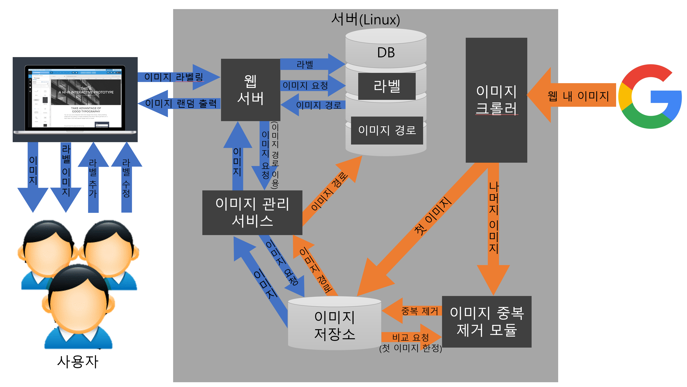

# 이미지 라벨링 프로젝트

## 프로젝트 개요

이미지를 이용한 이미지 분류 신경망의 학습에서 이미지 데이터와 이미지를 설명하는 라벨은 신경망의 학습 방향을 결정짓는 중요한 데이터이다. 소규모의 이미지 데이터는 전문가(이미지에 라벨을 부여할 수 있는 사람)에 의해 수행될 수 있으나 대량의 이미지 데이터는 제한된 수의 전문가로서 이미지 라벨링을 수행하는데 어려움이 있다. 이 프로젝트의 목표는 대량의 이미지 데이터를 다수의 전문가가 효율적으로 라벨링을 수행할 수 있도록 한다. 

## 프로그램 구조도

### 개발자

이민영 (dud1547@cu.ac.kr) - 이미지 라벨링 시스템 개발, 이미지 크롤러 개발
한정 (gkswjd9969@cu.ac.kr) - 이미지 라벨링 시스템 개발, 웹 UI 개발
안광은 (yooer10ms@cu.ac.kr) - 딥러닝 시스템 개발, Git 페이지 정원사(?)

개발자들은 [CONTRIBUTING](CONTRIBUTING.md)를 읽어주세요~

### 기여자

서동만 (sarum@cu.ac.kr) - 지도교수

## OSS 라이센스

[라이센스](LICENSE.md)