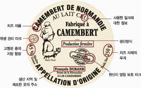

# **웹 UI 디자인 시 필요한 기능들 정리**
---
1. The Image Quiz ( http://www.gamesforthebrain.com/game/imagequiz/ )
    - 태그 입력
        - 텍스트 박스
        - 3번 오답 기회
    - 이미지 출력
        - 정답 태그와 관련된 이미지
        - 한 번에 여러 장(14장 정도)
    - 진행 형식
        - 정답
            - 10점 추가
            - Continue 버튼으로 다음 퀴즈 진행
        - 오답
            - 3번의 기회
            - 10점 감소
            - 정답 공개
            - Continue 버튼으로 다음 퀴즈 진행
        - 시간 제한
            - 60초
            - 카운트 종료
                - 오답(기회와 상관이 없음)
                - 정답 공개
---
2. ImageQuiz ( http://www.imagequiz.co.uk/ )
    - 퀴즈 생성
        - 퀴즈 타이틀 작성
        - 이미지 업로드 / 이미지 URL 작성
        - 이미지 라벨 여부( labelled / unlabelled )
            - labelled
                - 이미지에 라벨이 적혀있는 이미지
                ```
                ex)
                    
                ```
                - 라벨이 있는 부분에 네모칸을 그림
                - 네모칸을 그리면 팝업창이 뜨며 태그를 담
                - 이미지 아래에 태그가 저장이 됨
                    - 삭제 가능(휴지통 그림)
                - 태그를 다 설정하면 "submit boxes" 버튼을 클릭하며 문제 저장
            - unlabelled
                - 이미지에 라벨이 적혀있지 않은 이미지
                ```
                ex)
                    
                ```
                - 라벨을 지정하고 싶은 부분을 마우스 왼클릭으로 외곽선을 그림
                - 외곽선을 완성한 뒤 마우스 더블클릭하면 팝업창이 뜨며 태그를 담
                - 이미지 아래에 태그가 저장이 됨
                    - 삭제 가능(휴지통 그림)
                - 태그를 다 설정하면 "submit boxes" 버튼을 클릭하며 문제 저장
        - 퀴즈에 들어갈 태그 작성
    - 랜덤 퀴즈
        - 이미지 정보 출력
            - 이미지 제목
            - 스타트 버튼
            - 버튼 클릭 시 저장된 태그 랜덤 출력
        - 점수
            - 생성시 작성된 태그 수 만큼 책정
        - 이미지 출력
            - 이미지 내에 클릭 가능한 숨겨진 태그
                - 퀴즈 생성시에 작성된 태그 수 만큼 생성
        - Start버튼 클릭 시
            - 태그 랜덤 출력
            - 출력된 태그에 맞게 이미지 위치 클릭
        - 점수
            - 정답
                ```
                ex) Score : 1(맞힌 갯수)/1(출제된 문제 수)
                ```
            - 오답
                ```
                ex) Score : 0(맞힌 갯수)/1(출제된 문제 수)
                ```
                - 팝업 창과 함께 정답 공개
---
3. Google 크라우드 소싱 중 이미지 라벨 관련 ( https://crowdsource.google.com/imagelabeler/category )
    - 카테고리 별 분류
        - 카테고리 선택
           - 카테고리 별 이미지 출력
        - 이미지 내에 카테고리가 포함되는 여부 확인( 버튼 형식 )
            - 예 / 아니오
            - 건너뛰기
---
4. 팀원들 생각
    - 이미지내 부분 이미지 선택
        - 도형 그리기 이용
        - 도형 내 이미지 팝업
    - 태그 입력
        - 팝업된 부분 태그 입력
        - 태그 입력 텍스트 박스 생성
    - 추천 태그 출력
        - 팝업 창에 출력
        - 태그 빈도 수에 따른 글자 bold(?)
---